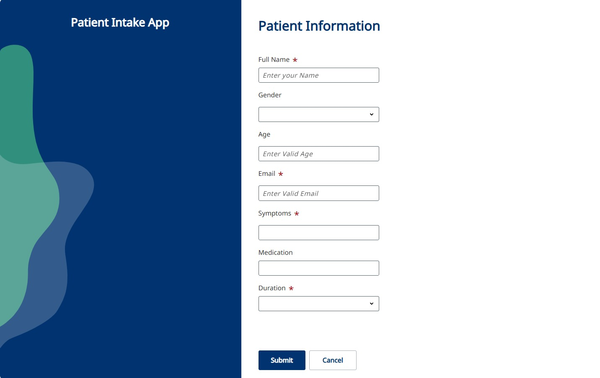
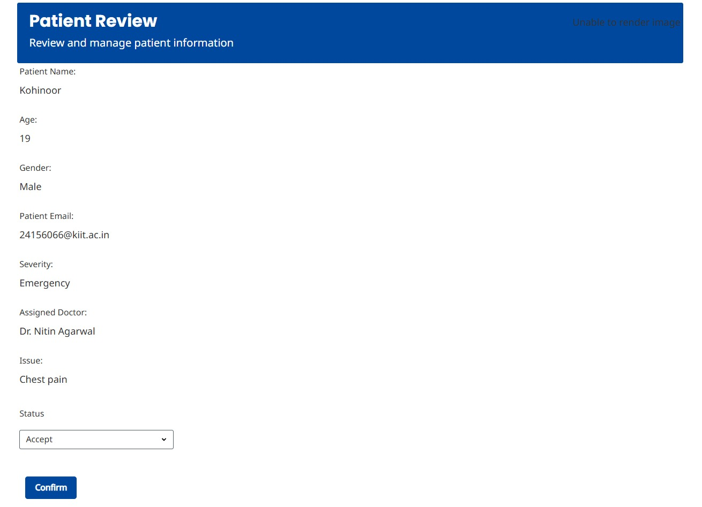
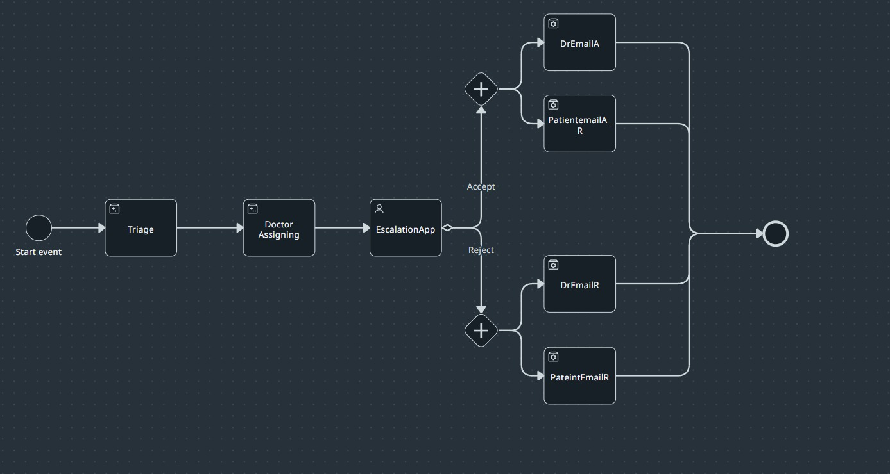
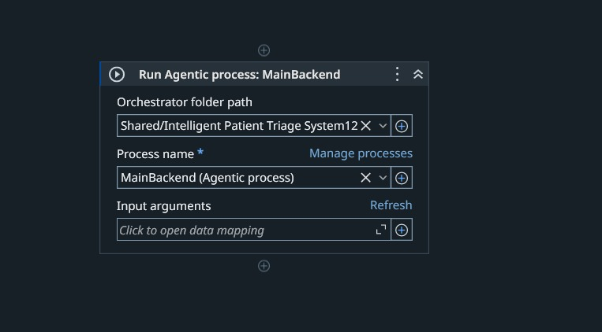
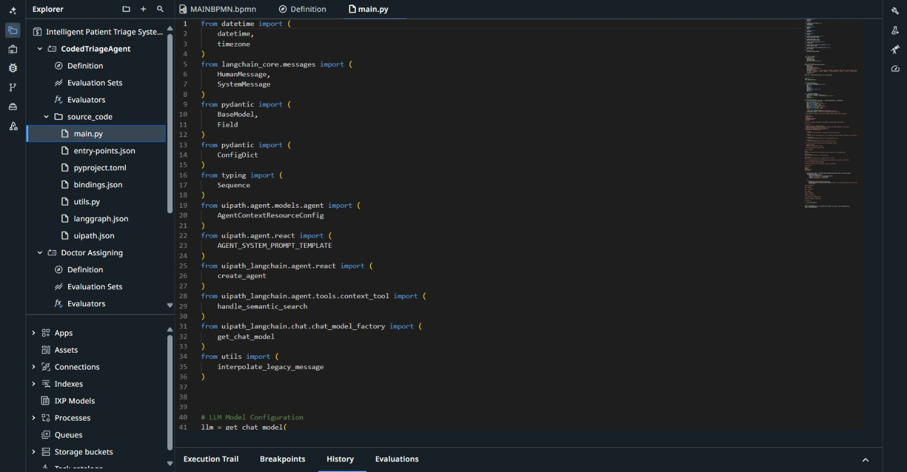

# 🚑 Intelligent Patient Triage System

<div align="center">

### AI-Powered Patient Prioritization & Doctor Assignment using UiPath Agentic Automation

Built for **UiPath AgentHack 2026**


</div>

---

## 📖 Overview

The **Intelligent Patient Triage System** is an AI-powered healthcare automation solution that helps healthcare providers efficiently prioritize patients and assign the appropriate doctor based on symptom severity.

Designed primarily for **rural and underserved communities**, the solution minimizes manual intervention, reduces waiting time, and ensures that emergency patients receive immediate attention through intelligent triage powered by UiPath Agentic Automation.

---

## 🎯 Problem Statement

Healthcare facilities often face:

* Long appointment waiting times
* Manual patient screening
* Delayed emergency identification
* Inefficient doctor allocation
* Limited healthcare accessibility in rural areas

This project automates the entire patient triage process from symptom submission to doctor assignment and patient notification.

---

## 💡 Solution

Patients submit their medical details through **UiPath Apps**.

A **UiPath Studio** automation sends the request to **UiPath Maestro**, where multiple AI agents collaborate to:

* Analyze symptoms
* Determine severity
* Prioritize patients
* Assign the appropriate doctor
* Notify both patient and doctor automatically

---

# 🏗 System Architecture

```text
Patient
   │
   ▼
UiPath Apps
   │
   ▼
UiPath Studio
   │
   ▼
UiPath Maestro
   │
   ├── Coded Agent
   │      │
   │      ▼
   │  Severity Analysis
   │
   ├── Triage Agent
   │      │
   │      ▼
   │ Priority Classification
   │
   ├── Doctor Assignment Agent
   │      │
   │      ▼
   │ Assign Specialist
   │
   ▼
Email Notification
```

---

# ⚙ Workflow

1. Patient submits symptoms using **UiPath Apps**.
2. UiPath Studio captures patient information.
3. Studio invokes the Agentic Process in UiPath Maestro.
4. The Coded Agent analyzes patient symptoms.
5. The Triage Agent determines the patient's priority.
6. The Doctor Assignment Agent selects the most suitable doctor.
7. The assigned doctor reviews the case.
8. Acceptance or rejection notifications are automatically emailed to both the patient and doctor.

---

# 🤖 AI Agents

| Agent                   | Responsibility                                             |
| ----------------------- | ---------------------------------------------------------- |
| Coded Agent             | Analyzes symptoms and determines severity                  |
| Triage Agent            | Categorizes patients into High, Medium, or Normal priority |
| Doctor Assignment Agent | Matches patients with the appropriate medical specialist   |

---

# 🛠 Tech Stack

| Technology          | Purpose                            |
| ------------------- | ---------------------------------- |
| UiPath Apps         | Patient Intake Interface           |
| UiPath Studio       | Workflow Automation                |
| UiPath Maestro      | Agent Orchestration                |
| UiPath Coded Agents | Severity Analysis                  |
| UiPath AI Agents    | Patient Triage & Doctor Assignment |
| UiPath Orchestrator | Process Management                 |
| Email Activities    | Automated Notifications            |

---

# 📸 Screenshots

## Patient Intake Application



Patients submit their symptoms and medical details through an intuitive UiPath Apps interface.

---

## Patient Review Dashboard



Doctors can review patient details, severity level, assigned diagnosis, and accept or reject the case.

---

## UiPath Maestro Workflow



Agentic workflow coordinating patient triage, doctor assignment, and notification processes.

---

## Studio Automation



UiPath Studio invokes the Agentic Process through Maestro to automate backend execution.

---
## Coded Agent



Coded Agent Structure.
---

# 📂 Project Structure

```text
Intelligent-PatientTriage-System-AgentHack2026/ │ ├── 📄 Intelligent Patient Triage System.uipx ├── 📄 SolutionStorage.json │ ├── 📁 MainBackend/ │ ├── MAINBPMN.bpmn │ ├── bindings_v2.json │ ├── entry-points.json │ └── project.uiproj │ ├── 📁 RPA Workflow/ │ ├── Main.xaml │ ├── entry-points.json │ ├── project.json │ └── project.uiproj │ ├── 📁 CodedTriageAgent/ │ ├── main.py │ ├── utils.py │ ├── agent.json │ ├── bindings.json │ ├── langgraph.json │ ├── pyproject.toml │ ├── uipath.json │ ├── entry-points.json │ └── project.uiproj │ ├── 📁 Triage/ │ ├── agent.json │ ├── flow-layout.json │ ├── entry-points.json │ └── project.uiproj │ ├── 📁 Doctor Assigning/ │ ├── agent.json │ ├── flow-layout.json │ ├── entry-points.json │ └── project.uiproj │ ├── 📁 DrApprovalApp/ │ ├── Main.xaml │ ├── PatientReviewFormPage1_Confirm_click.xaml │ ├── entry-points.json │ ├── project.json │ └── project.uiproj │ ├── 📁 DrEmailA/ │ ├── Main.xaml │ ├── entry-points.json │ └── project.uiproj │ ├── 📁 DrEmailR/ │ ├── Main.xaml │ ├── entry-points.json │ └── project.uiproj │ ├── 📁 PatientemailA/ │ ├── Main.xaml │ ├── entry-points.json │ └── project.uiproj │ ├── 📁 PateintEmailR/ │ ├── Main.xaml │ ├── entry-points.json │ └── project.uiproj │ ├── 📁 docs/ │ └── 📁 images/ │ ├── patient-intake.png │ ├── patient-review.png │ ├── maestro-workflow.png │ └── studio-agent-process.png │ ├── 📄 README.md └── 📄 LICENSE
```

---

# 🚀 Features

* Intelligent symptom analysis
* AI-powered patient prioritization
* Automated doctor assignment
* Human-in-the-loop approval
* Automatic patient and doctor email notifications
* Agentic orchestration using UiPath Maestro
* End-to-end healthcare workflow automation

---

# 🔮 Future Enhancements

* Voice-based symptom submission
* Multilingual support
* Electronic Health Record (EHR) integration
* Real-time hospital availability
* SMS & WhatsApp notifications
* Predictive analytics for patient outcomes
* Wearable device integration

---

# 🌍 Impact

* Faster emergency response
* Reduced administrative workload
* Improved doctor allocation
* Better healthcare accessibility
* Scalable healthcare automation
* Enhanced patient experience

---

# 👥 Team

**OrchestrATE**
Members:
1. **Kohinoor Soni**
2. **Sneha Ram**
3. **Kavya Mahto**
4. **Rahul**
* Built as part of **UiPath AgentHack 2026**.

---

# 📜 License

This project is licensed under the **Apache License**.

---

<div align="center">

**Empowering Healthcare through Agentic AI and Intelligent Automation**

Made with ❤️ using UiPath Agentic Automation

</div>
